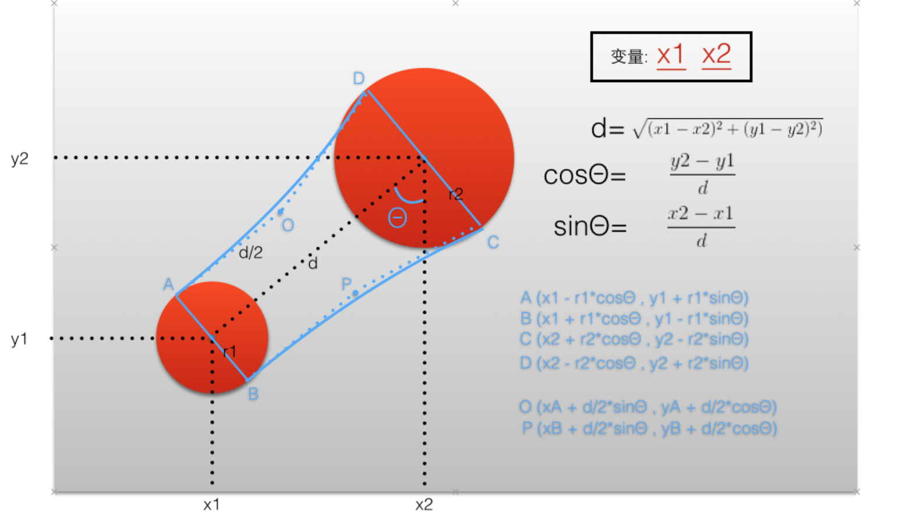

# iOS-AdvancedAmination-Learn

##Demo List

1.JCuteView

思想：
计算出粘性边界关键点的通用坐标
根据算出的坐标通式，用贝塞尔曲线画出粘性部分的边界，在手势方法里重绘

2.JAppSplashAnimtion
仿 twitter首页

##动画学习资料
1.具体参考书籍A GUIDE TO IOS ANIMATION 2.0

2.<https://zsisme.gitbooks.io/ios-/content/>

##动画

1.JAPPSiderMenuDemo 思想 为辅助视图 
<http://holko.pl/2014/06/26/recreating-skypes-action-sheet-animation/>
